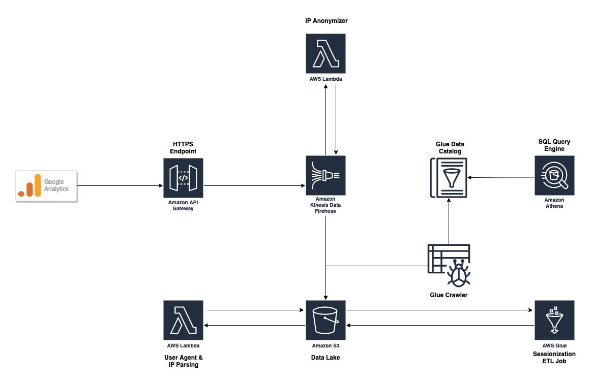

# Google Analytics To S3 
This piece of software automatically duplicates Google Analytics hits to S3.
Additionally, it does ETL on the incoming raw data. It transforms the raw Google Analytics data to the
BigQuery export schema format.

## Basic Architecture Overview



## Setup

1. Run `git clone` this repository and `cd` into directory.

2. Run `make create_bucket`. This command will create an s3 bucket for Cloudformation
   artifacts.

3. Run `make deploy`. This command is going to deploy the Cloudformation stack.

4. Create a **Custom JavaScript variable** in Google Tag Manager. Call the variable `Pipes duplicator` and add the following code:

```js
function() {
  // Add your pipes collector endpoint here
  var endpoint = 'https://collector.endpoint.com/';
  
  return function(model) {
    var vendor = 'com.google.analytics';
    var version = 'v1';
    var path = ((endpoint.substr(-1) !== '/') ? endpoint + '/' : endpoint) + vendor + '/' + version;
    
    var globalSendTaskName = '_' + model.get('trackingId') + '_sendHitTask';
    
    var originalSendHitTask = window[globalSendTaskName] = window[globalSendTaskName] || model.get('sendHitTask');
    
    model.set('sendHitTask', function(sendModel) {
      var payload = sendModel.get('hitPayload');
      originalSendHitTask(sendModel);
      var request = new XMLHttpRequest();
      request.open('POST', path, true);
      request.setRequestHeader('Content-type', 'text/plain; charset=UTF-8');
      request.send(payload);
    });
  };
}
```

**Important:** Don't forget to change the endpoint in the code. The endpoint
you can find in Cloudformation under the deployed Google Analytics Nested Stack
[more](#additional-information)

---

5. Edit **EVERY SINGLE** Google Analytics tag whose data you want to send to Pipes. Go to **Tags**, click on a **Tag Name** you want to edit. Click on **Enable overriding settings in this tag**. Click on **+Add Field**, use `customTask` as a field name and `{{Pipes duplicator}}` as a value. Click save.


---

3. Step: Publish a new version in Google Tag Manager. After publishing a new version, all Google Analytics hits will be sent to Pipes automatically.

---

### Additional Information
* Google Analytics Duplicator Endpoint


* Inspired by Simo Ahava: [Simo's blog](https://www.simoahava.com)

